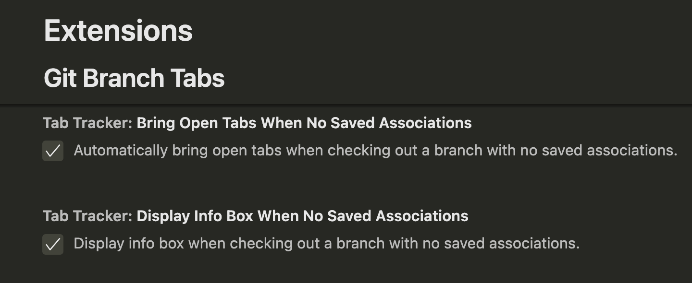

# Git Branch Tabs

## About

Tracks open tabs for each Git branch and restores them when switching branches.

Prompts you when no saved tab associations are found for a branch.

## Settings

## Release Notes

### 0.0.1

Initial release of git tab tracker.

## 0.0.2

Update README, package name, package description, and settings.